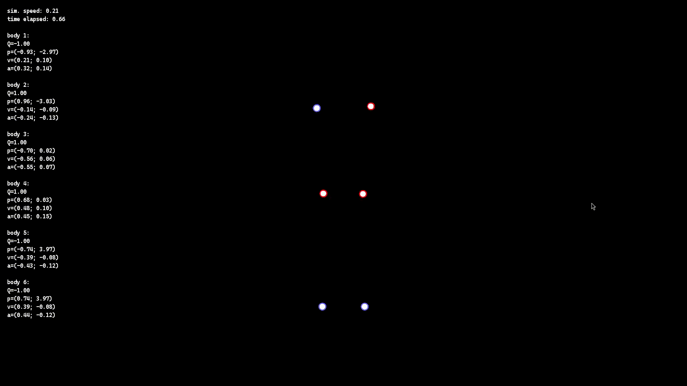
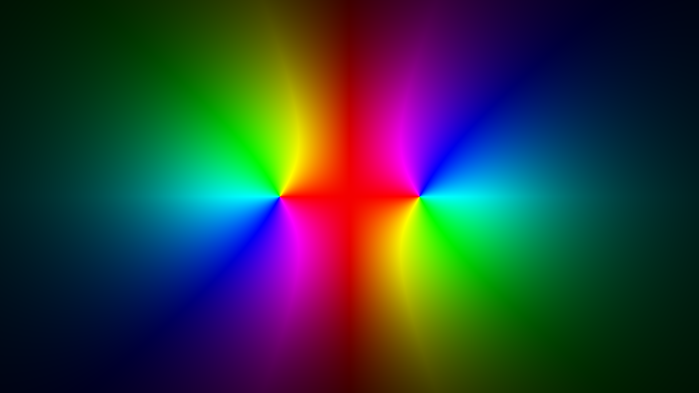
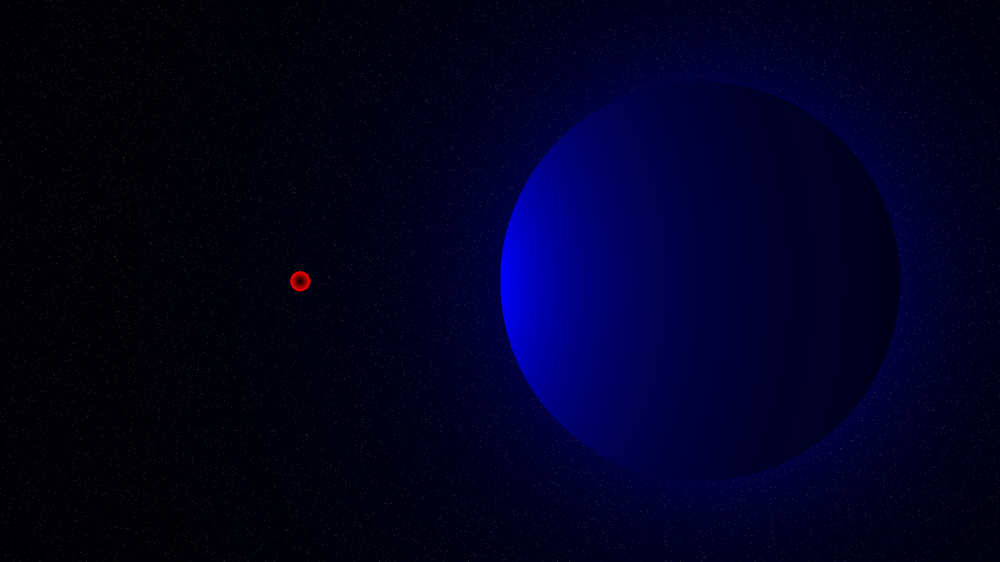
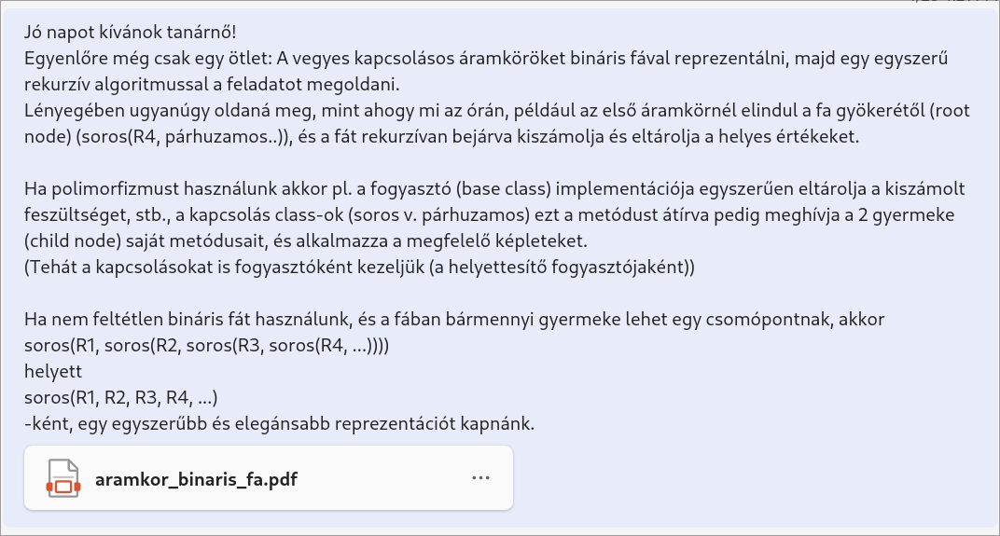

# Bevezetés
Ez a monorepo a 2024-25-ös tanévi (10. osztály) iskolai tananyaggal kapcsolatos munkáimat tartalmazza.

> [!NOTE]
> Feltöltés és bemutatás folyamatban...

# Fizika

## Rugó szimulátor
TODO: forráskód (Python, PyGame)

Egy egyszerű, Euler-féle módszert alkalmazó rugó szimulátor.

### Képek
TODO: szimulációk forráskódja, jobb alt szövegek

Különböző hosszúságú ingák lengése, lengésideje:

Csatolt rezgés:

Egyéb:

## Harmonikus rezgőmozgás animáció
TODO: statikus kép -> gif

- [A Desmos grafikon linkje](https://www.desmos.com/calculator/n7aijnefve)
- [Magyarázóvideó](temp_fizika/harmonikus_rezgomozgas.mkv)

## Töltéses N-test szimuláció
[Forráskód](temp_fizika/fiz_szim.cpp) (C++ nyelven, az SFML multimédia könyvtár használatával)

Videók: [videó 1](temp_fizika/egyszeru_szimulacio.mkv), [videó 2 (taszítás)](temp_fizika/taszitas.mkv), [videó 3 (javított)](temp_fizika/fiz_szim_javitott.mkv)

## Kisebb vizualizációk

### Házi animáció
Egy kis animáció [Manim](https://github.com/ManimCommunity/manim/)-mal egy egyszerű házi feladat megoldásáról.

[Forráskód](temp_fizika/hazi_animacio.py) (Python)

[Az animáció lassabban, jobb minőséggel](temp_fizika/hazi_animacio.mp4)

### Elektromos mezők
TODO: forráskód (Python), magyarázat

Elektromos mezők ábrázolása HSV színtérrel (a színkerékhez hasonlóan).

### Héjtétel
TODO: forráskód (Python)

Az egyik fizikaórán felmerült, a homogén gömbök esetén a középpontjuk közötti távolsággal kell számolni a gravitációs erőt, és nem láttam, hogy ha felbontjuk sok kisebb testre, akkor az erővektorok összege miért lenne azonos, mintha az egész test középpontjával számoltunk volna, így írtam egy kis programot, ami ezt ábrázolja, és kiszámolja. Utána megtaláltam a [héjtételt](https://hu.wikipedia.org/wiki/Gravit%C3%A1ci%C3%B3s_potenci%C3%A1l#G%C3%B6mbszimmetria) is, ami minden gömbileg szimmetrikus testre igazolja.

## Áramkörös feladatok megoldása bináris fa reprezentáció alkalmazásával
### a) Egyszerűbb
TODO: forráskód, példák

Ezen segédkönyvtár segítségével olyan áramkörös feladatokat lehet megoldani, amiben
- ismertek a fogyasztók ellenállásai
- legalább egy feszültség/áramerősség/teljesítmény ismert

Működése:
1. helyettesítő fogyasztók ellenállásainak kiszámolása
2. az ismert adat és megfelelő fogyasztó ellenállása alapján az összes feszültség kiszámolása
3. szükség esetén egyéb adatok kiszámolása az ismert ellenállások és kiszámolt feszültségek alapján

[a mellékelt pdf](https://github.com/Krist0FF-T/suli_tanev_2024/blob/main/temp_fizika/aramkor_binaris_fa.pdf)

### b) Összetettebb
TODO: alap ötlet, eddigi forráskód (Python)

(A fejlesztés szünetel.)

### Kicsit összetetteb

## Jövőbeli tervek:
- egy nagyobb és hatékonyabb N-test szimuláció (quadtree struktúra használatával)
- oktatóvideók készítése Manim-mal
    - (jóval előbb el kell kezdenem, hogy még releváns legyen)
    - (rengeteg idő elkészíteni)
- néhány eddig elkészített munkáim újraírásáról videók magyarázattal
    - (rugó szimulátor, feszültség- és áramerősség kiszámoló program)

# Matematika
Kicsit ironikusan talán, de az idei matematika tananyaggal kapcsolatban nem sokat csináltam - csak egy egyenletábrázolót. Ezen kívül esetleg másodfokú polinomok gyökeit kiszámomló programot lehetett volna, de Python-ban 1 sorban meg lehet (meg tudom) oldani (tehát programozási szempontból tényleg elég egyszerű)

## Egyenletábrázoló
TODO: forráskód, példák, LaTeX

### Működése
- minden pixelnél kiszámolja az egyenlet két oldalának értékét x és y behelyettesítésével és e 2 érték különbsége alapján színezi be
- világosság (0..1) = 1 / (1 + 10d) ^ 2
    - (ahol "d" a két oldal különbségének az abszolútértéke)
    - így ha d=0, akkor 1 (100%), és ahogy d nő, egyre sötétül
    - (általában ezt használtam, vagy ehhez hasonlót)
    - (több egyenlet ábrázolásánál kicsit bonyolultabb)

### Egy egyszerű példa

TODO: LaTeX, színes körök (piros, kék, szürke)

- y = sin(x)
    - (piros)
- y = cos(x)
    - (kék)
- sin(x * pi) = 0
    - (függőleges)
- sin(y * pi) = 0
    - (vízszintes)

# Rajz

### Egyenletarc

TODO: képletek LaTeX-el, színes körök

(Végül máshogy oldottam meg, és azóta sem fejeztem be. A szája sehogy se akar jól kinézni.)

- ábrázolt egyenletek:
    - piros (szem körvonal):
        - |y - ysz| = -cos(x)
        - ha |x| < 6 (hogy a fejen kívül ne ismétlődjön)
    - kék (pupilla):
        - dsz^2 = dsz * sqrt(2)/2
    - zöld (fej és haj körvonal):
        - do = rf
        - do = rh
    - sárga (haj besatírozása):
        - sin((x - y) * 4) = 0
        - ha rh < do < rf
    - (+ egy halvány négyzetrács a feljebb említett módszerrel)

- ahol:
    - ysz = 0.6
        - (szemek magassága)
    - dsz = sqrt((|x| - pi)^2 + (y - ysz)^2)
        - (távolság a jobb/bal szem középpontjától)
    - do = sqrt(x^2 + y^2)
        - (távolság az origótól)
    - rf = 6
        - (fej sugara)
    - rh = rf - max(0, (|sin(pi/2 * x + 0.3)| + rf/2) * sin(alfa))
        - ahol alfa = arctan(y/x)

### Fraktál görbe animáció renderelő
TODO: a 2 animáció gif-ként, forráskód, YT link
- [Program újraírása](https://www.youtube.com/watch?v=Pmu5Lj8mTVE) (YouTube videó)
- [Forráskód és az elkészült animációk](https://github.com/Krist0FF-T/fractal_renderer) (GitHub repo)

https://github.com/user-attachments/assets/e323bc35-458e-4ba9-bd7d-179e8875ee65

https://github.com/user-attachments/assets/c4f59d11-ec05-4634-9aff-ace791651d8a

